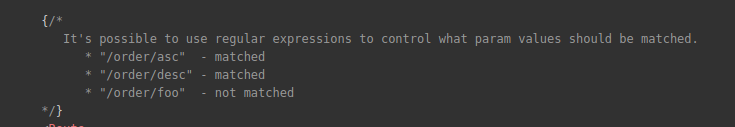
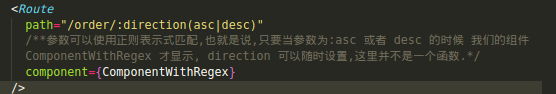

 # 这是关于自己对 REACT-router v4+ 版本学习理解做的dome
 ## [这里献上git](https://github.com/zengibm/reactRouter)
 ## [官方文档](https://reacttraining.com/react-router/web/example/auth-workflow)
 ## [参考](https://www.sitepoint.com/react-router-v4-complete-guide/)
 ## react 死循环之自己引用自己.
### 组件解释
1.  BrowserRouter : 创建URL
```
> <BrowserRouter />
> http://example.com/about
```
2.  HashRouter: 创建URL
```
> <BrowserRouter />
> http://example.com/#/about
```
3.  Route : 路由显示什么组件,显示在什么位置,它有三个props用来定义渲染内容:
 - component
 - render
 - children
4.  switch : The <Switch> is not required for grouping <Route>s, but it can be quite useful. A <Switch> will iterate over all of its children <Route> elements and only render the first one that matches the current location. This helps when multiple route’s paths match the same pathname, when animating transitions between routes, and in identifying when no routes match the current location (so that you can render a “404” component).
5.  Link : a 链接作用, to 属性不能少.
6.  NavLink : 一个特殊版本<Link>，它将在与当前URL匹配时为渲染元素添加样式属性。
7.  Redirect : 当`<Redirect>`被使用的时候,它会将当前url导入他的to值指向的url组件.

***
### dome笔记
#### 路由器组件只能有一个子元素,子元素可以是HTML 元素div - 或反应组件.
- dome1 是关于基本的使用.
    1. exact 作用的让定义了这个props的组件仅在url等于path值的时候显示.
    1. match 在 this.props 中
- dome2 是关于url参数的获取.
    1.  官方文档说:可以使用正则表达式来控制应匹配哪些参数值.
    2.         参数可以使用正则表示式匹配,也就是说,只要当参数为:asc 或者 desc 的时候 我们的组件ComponentWithRegex 才显示, direction 可以随时设置,这里并不是一个函数.
- dome3 理解 switch
	1. switch 将迭代所有route子元素,仅渲染与当前位置匹配的第一个子元素.
	2. 当没有路径与当前位置匹配的时候就选择没有设置path  **props**  的组件进行渲染.(这样的功能可以实现404的效果)
- 重定向

- 自定义路由


